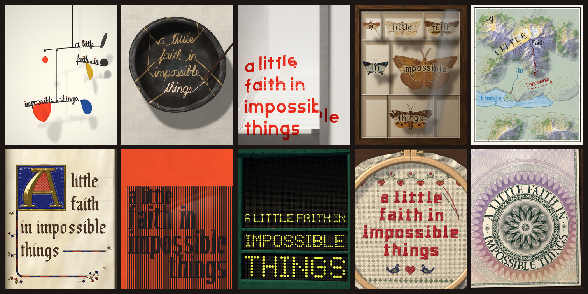

# A little faith in impossible things

One phrase, ten art styles, all of it code. Each style is a single self-contained HTML page that draws `a little faith in impossible things` on a Canvas 2D context, with no images, fonts or libraries.

## The styles

- **Calder mobile** (`11-calder`): each arm's torques are solved in code, and the red a's weight levels the top rod.
- **Kintsugi** (`12-kintsugi`): cracks are routed so their gold seams spell the phrase; the last seam is still wet.
- **After Felice Varini** (`13-varini`): paint is projected from one seat, so the phrase locks flat only there.
- **Specimen drawer** (`16-specimen`): each word masks a moth's scale grid; each cover scale is angled and lit alone.
- **Swiss relief map** (`18-relief`): a height field is contoured and hill-shaded; each word is an engraved name.
- **Gilded manuscript** (`09-manuscript`): broad-nib strokes at one fixed pen angle; an agate pass burnishes the gold A.
- **Scanimation** (`07-scanimation`): two poses cut in alternating strips; a striped acetate laid on shows one at a time.
- **Flip-dot sign** (`06-flip-dot`): 6,184 discs, each on its own axle; 427 turn, strike their stop and rebound.
- **Cross-stitch** (`02-cross-stitch`): each leg is two strands drawn as lit tubes, laid row by row in Danish order.
- **Banknote engraving** (`03-banknote`): sine curves turned on a virtual lathe; the legend is cut as raised ink.

## Run it

Open any `index.html` in a browser to see the finished piece. Each page builds itself from a blank surface over six seconds; add `?t=2.5` to the URL to see any moment of the build. Every frame is deterministic: `window.__riso.seek(t)` draws frame `t`, with all randomness seeded by stable strings.

## Credits

Written and rendered in code by Claude Opus 5.5. The seeded random helpers `xmur3` and `mulberry32` in the Flip-dot page come from [bryc/code](https://github.com/bryc/code).

## License

MIT
